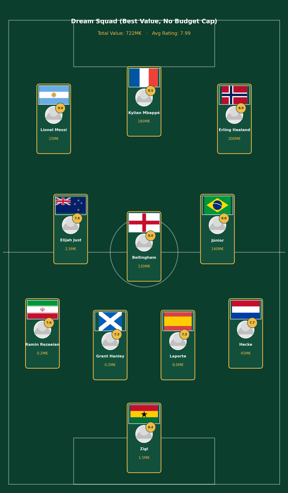
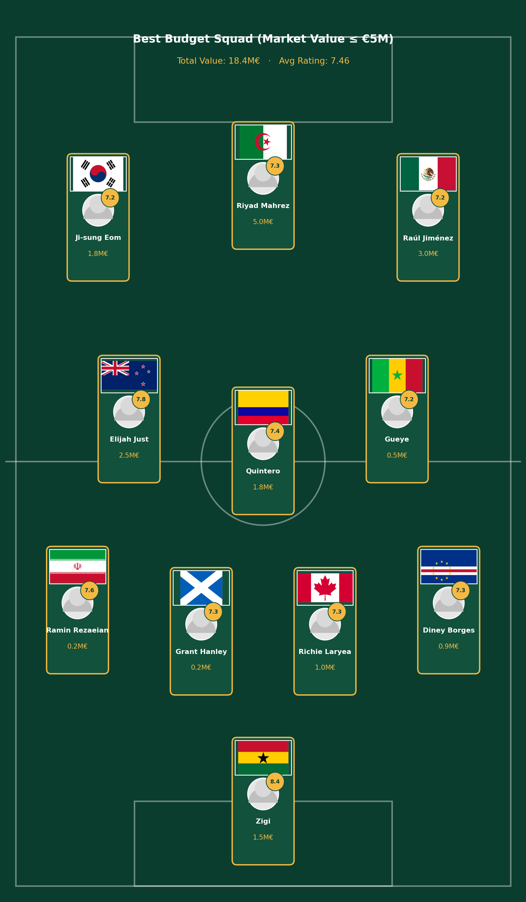
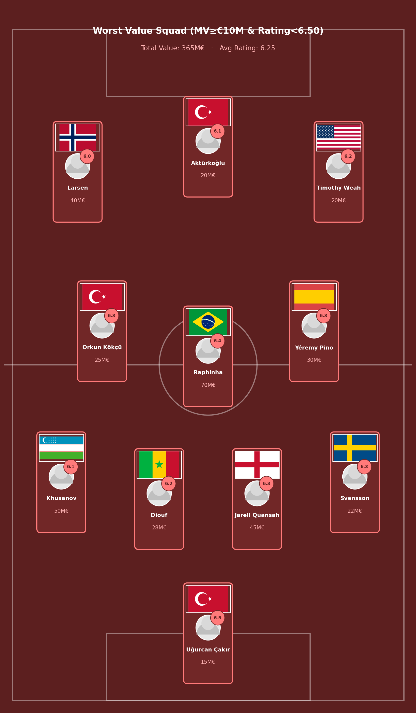
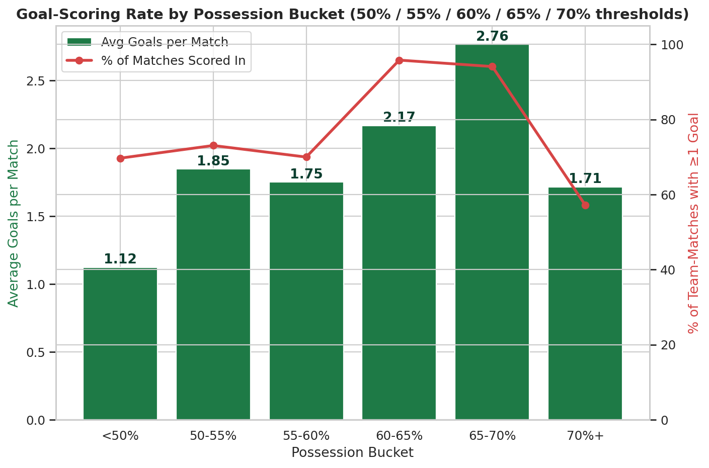
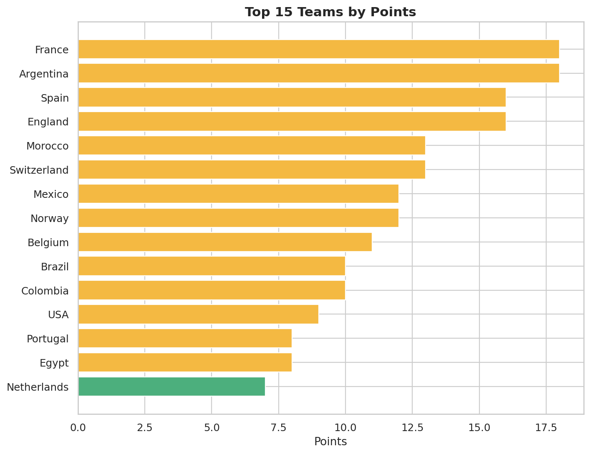
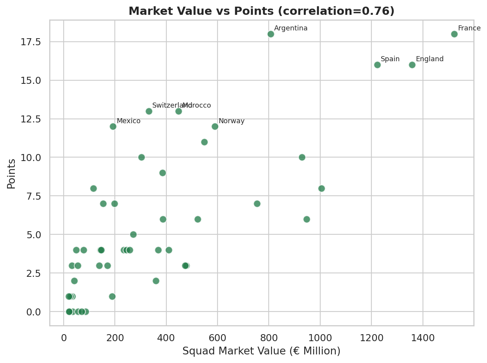
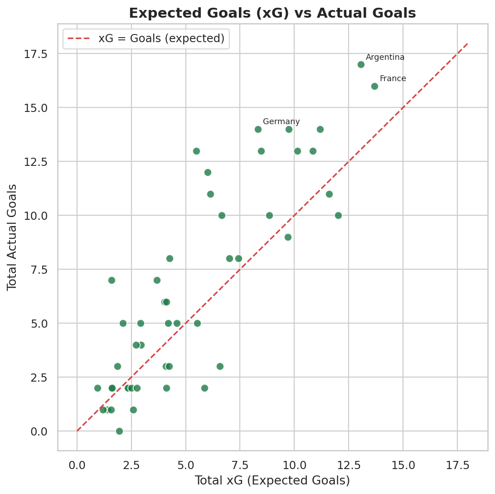
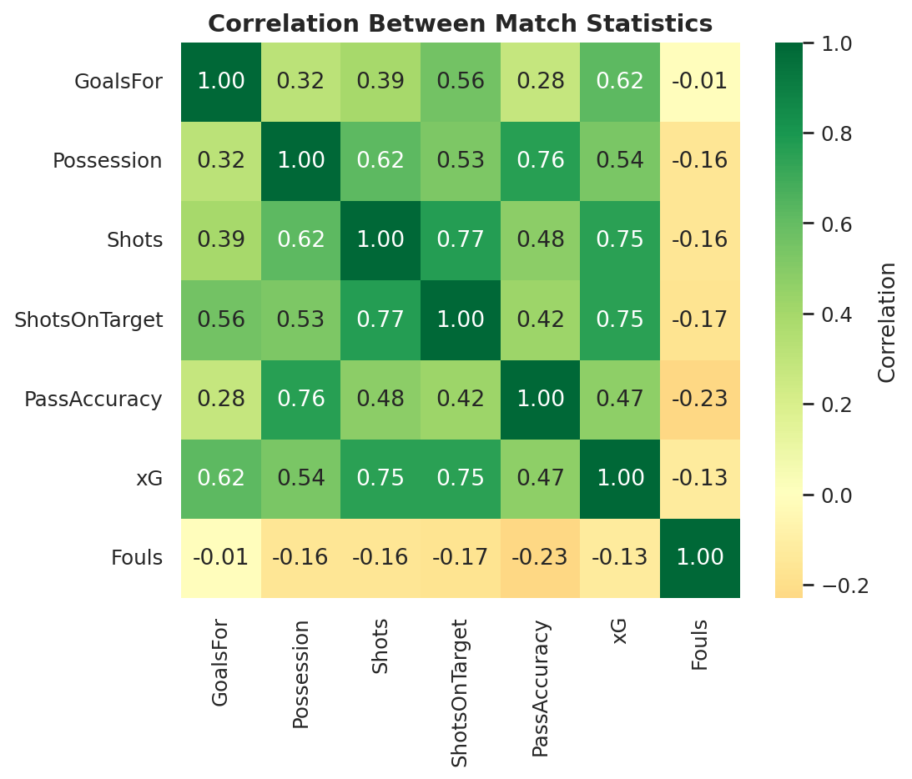

<div align="center">

# ⚽ FIFA Dünya Kupası 2026
## Veri Analizi ve Oyuncu Değeri Projesi



<br>

[](https://www.python.org/)
[](https://pandas.pydata.org/)
[](https://jupyter.org/)


**Hazırlayan: [Resul Işık](https://github.com/resulisik)**

[LinkedIn](https://www.linkedin.com/in/resul-isik/) ·
[🇬🇧 English README](README.md)

</div>

---

## 📌 Proje Hakkında

Bu proje, **2026 FIFA Dünya Kupası'nın** grup aşamasından çeyrek final aşamasına kadar olan bölümünü kapsayan uçtan uca bir veri analizi çalışmasıdır.

Projede:

- **100 karşılaşma**
- **5.012 oyuncu-maç kaydı**
- Takım ve oyuncu performans analizleri
- Beklenen gol ve topa sahip olma analizleri
- Oyuncu piyasa değeri karşılaştırmaları
- Fiyat/performans hesaplamaları
- Mevkilere göre oyuncu sıralamaları
- Üç farklı 4-3-3 kadro oluşturma çalışması
- Otomatik veri temizleme ve görselleştirme süreci

yer almaktadır.

Projenin temel amacı; **oyuncu performansı, takım başarısı, kadro piyasa değeri, beklenen gol, topa sahip olma oranı ve maliyet verimliliği** arasındaki ilişkileri incelemektir.

> **Veri notu:** Projede kaynak belirtilen maç bilgileriyle birlikte örnek veya simüle edilmiş bazı veri alanları bulunmaktadır. Eksiksiz resmî verinin bulunmadığı bazı ikincil istatistikler, maçın genel yapısıyla tutarlı olacak şekilde tahmin edilmiştir.

---

## 🎯 Araştırma Soruları

1. Turnuvanın en başarılı takımları hangileridir?
2. Daha pahalı bir kadroya sahip olmak daha fazla puan getiriyor mu?
3. Piyasa değerine kıyasla en iyi performansı hangi oyuncular gösterdi?
4. Beklenen gol ile gerçek gol sayısı arasında nasıl bir ilişki vardır?
5. Daha fazla topa sahip olmak her zaman daha fazla gol getirir mi?
6. En iyi fiyat/performans ilk 11'i nasıl görünürdü?
7. Hangi pahalı oyuncular beklentilerin altında kaldı?

---

## 🔍 Önemli Sonuçlar

| Ölçüm | Sonuç |
|---|---|
| Toplam gol | **100 maçta 317 gol** |
| Maç başına gol | **3,17** |
| En başarılı takım | **Fransa** |
| En iyi oyuncu performansı | **Lionel Messi — 9,03 ortalama puan** |
| En yüksek piyasa değeri | **Lamine Yamal ve Erling Haaland — 200 milyon €** |
| Golle en güçlü ilişkili ölçüm | **Beklenen gol — korelasyon ≈ 0,62** |
| Kadro değeri ve puan ilişkisi | **Korelasyon ≈ 0,76** |
| En iyi fiyat/performans takımı | **Arjantin** |
| En iyi fiyat/performans oyuncusu | **Lionel Messi** |
| En iyi bütçe kalecisi | **Vozinha — 50 bin € piyasa değeri** |

### Öne Çıkan Bulgular

- Beklenen gol değerinin gerçek gol sayısıyla ilişkisi, topa sahip olma oranından daha güçlüdür.
- Takımların kadro piyasa değeri ile topladıkları puanlar arasında anlamlı bir pozitif ilişki bulunmuştur.
- Çok yüksek topa sahip olma oranı her zaman daha fazla gol anlamına gelmemektedir.
- Gol üretimi %65–70 topa sahip olma aralığına kadar yükselmiştir.
- %70'in üzerinde topa sahip olan takımların gol atma oranı belirgin şekilde düşmüştür.
- Düşük piyasa değerine sahip bazı oyuncular, çok daha pahalı oyuncularla benzer veya daha iyi performans göstermiştir.

---

## 💰 Fiyat/Performans Hesaplama Yöntemi

Oyuncuların fiyat/performans analizi şu ilişkiye göre oluşturulmuştur:

```text
Ortalama Oyuncu Puanı ~ Piyasa Değerinin Logaritması
```

Regresyon modeli, oyuncunun piyasa değerine göre beklenen performansını hesaplamaktadır.

Gerçek performans ile beklenen performans arasındaki fark:

```text
ValueResidual
```

değişkeniyle gösterilmektedir.

- **Pozitif residual:** Oyuncu fiyatına göre beklenenden daha iyi performans göstermiştir.
- **Negatif residual:** Oyuncu fiyatına göre beklenenden daha kötü performans göstermiştir.
- **Sıfıra yakın residual:** Oyuncunun performansı piyasa değeriyle genel olarak uyumludur.

---

## 🏆 Mevkilere Göre En İyi Fiyat/Performans Oyuncuları

| Mevki | Oyuncu | Ülke | Ortalama Puan | Piyasa Değeri |
|---|---|---|---:|---:|
| Kaleci | Vozinha | Cabo Verde | 7,88 | 0,05 milyon € |
| Defans | Ramin Rezaeian | İran | 7,57 | 0,25 milyon € |
| Orta saha | Elijah Just | Yeni Zelanda | 7,83 | 2,5 milyon € |
| Forvet | Lionel Messi | Arjantin | 9,03 | 15 milyon € |

---

## 📉 En Düşük Fiyat/Performans Oyuncuları

| Mevki | Oyuncu | Ülke | Ortalama Puan | Piyasa Değeri |
|---|---|---|---:|---:|
| Kaleci | Uğurcan Çakır | Türkiye | 6,50 | 15 milyon € |
| Defans | Abdukodir Khusanov | Özbekistan | 6,13 | 50 milyon € |
| Orta saha | Orkun Kökçü | Türkiye | 6,27 | 25 milyon € |
| Forvet | Ferran Torres | İspanya | 6,28 | 50 milyon € |

---

## 🌟 En İyi Fiyat/Performans Kadrosu — 4-3-3

Bu kadro oluşturulurken en az **7,00 ortalama puan** şartı uygulanmış, oyuncular mevkilerine göre ayrılmış ve en yüksek fiyat/performans skoruna sahip isimler seçilmiştir.

| Mevki | Oyuncu | Takım | Puan | Piyasa Değeri |
|---|---|---|---:|---:|
| Kaleci | Vozinha | Cabo Verde | 7,88 | 0,05 milyon € |
| Defans | Ramin Rezaeian | İran | 7,57 | 0,25 milyon € |
| Defans | Aymeric Laporte | İspanya | 7,52 | 8 milyon € |
| Defans | Jan Paul van Hecke | Hollanda | 7,65 | 45 milyon € |
| Defans | Richie Laryea | Kanada | 7,30 | 1 milyon € |
| Orta saha | Elijah Just | Yeni Zelanda | 7,83 | 2,5 milyon € |
| Orta saha | Jude Bellingham | İngiltere | 8,03 | 130 milyon € |
| Orta saha | Vinícius Júnior | Brezilya | 8,00 | 140 milyon € |
| Forvet | Lionel Messi | Arjantin | 9,03 | 15 milyon € |
| Forvet | Kylian Mbappé | Fransa | 8,50 | 180 milyon € |
| Forvet | Erling Haaland | Norveç | 7,96 | 200 milyon € |

**Toplam kadro değeri:** 721,8 milyon €  
**Ortalama oyuncu puanı:** 7,93  
**Diziliş:** 4-3-3

<div align="center">
  
</div>

---

## 🆚 Kadro Karşılaştırması

| Kadro | Toplam Piyasa Değeri | Ortalama Puan | Seçim Kuralı |
|---|---:|---:|---|
| En İyi Fiyat/Performans Kadrosu | 721,8 milyon € | 7,93 | En verimli oyuncular |
| En İyi Bütçe Kadrosu | 18,45 milyon € | 7,46 | Değeri 5 milyon € ve altında olan oyuncular |
| En Kötü Fiyat/Performans Kadrosu | 365 milyon € | 6,25 | Pahalı ancak düşük puanlı oyuncular |

<div align="center">
  
  
</div>

---

## ⚽ Topa Sahip Olma ve Gol Analizi

| Topa Sahip Olma Aralığı | Takım-Maç Sayısı | Ortalama Gol | Gol Atma Oranı |
|---|---:|---:|---:|
| %50'nin altı | 99 | 1,12 | %69,7 |
| %50–55 | 26 | 1,85 | %73,1 |
| %55–60 | 20 | 1,75 | %70,0 |
| %60–65 | 24 | 2,17 | %95,8 |
| %65–70 | 17 | 2,76 | %94,1 |
| %70 ve üzeri | 14 | 1,71 | %57,1 |

Gol üretimi, %65–70 topa sahip olma aralığına kadar yükselmiştir. Ancak %70'in üzerinde topa sahip olan takımlar, bütün gruplar arasındaki en düşük gol atma oranına sahip olmuştur.

<div align="center">
  
</div>

---

## 📊 Örnek Görselleştirmeler

<table>
<tr>
<td width="50%" align="center">
<b>Takım Puanları</b><br><br>

</td>
<td width="50%" align="center">
<b>Piyasa Değeri ve Puan</b><br><br>

</td>
</tr>
<tr>
<td width="50%" align="center">
<b>Beklenen Gol ve Gerçek Gol</b><br><br>

</td>
<td width="50%" align="center">
<b>Korelasyon Haritası</b><br><br>

</td>
</tr>
</table>

---

## 📁 Proje Yapısı

```text
fifa2026-analysis/
├── data/
│   ├── player_ratings.csv
│   ├── match_statistics.csv
│   └── processed/
│       ├── player_ratings_clean.csv
│       ├── match_statistics_clean.csv
│       ├── team_summary.csv
│       ├── player_summary.csv
│       ├── possession_goal_rate.csv
│       ├── player_value_analysis_marketvalue.csv
│       ├── team_value_analysis_marketvalue.csv
│       ├── squad_worst_value_xi.csv
│       ├── squad_best_budget_xi.csv
│       └── squad_dream_xi.csv
├── notebooks/
│   └── FIFA2026_Analysis.ipynb
├── presentations/
│   ├── FIFA2026_UcKadro_DegerAnalizi_TR.pptx
│   └── FIFA2026_ThreeSquads_ValueAnalysis_EN.pptx
├── visuals/
├── flags_png/
├── flags_latex_src/
├── run_analysis.py
├── add_quarterfinals.py
├── add_marketvalue_analysis.py
├── add_salary_analysis.py
├── build_squads.py
├── build_squad_visuals.py
├── build_notebook.py
├── flag_utils.py
├── requirements.txt
├── README.md
└── README_TR.md
```

---

## 📂 Veri Setleri

| Veri Seti | Kayıt | Açıklama |
|---|---:|---|
| `player_ratings.csv` | 5.012 | Oyuncu puanları, süreleri, mevkileri ve piyasa değerleri |
| `match_statistics.csv` | 100 | Skor, topa sahip olma, şut, xG, pas, kart ve korner verileri |
| `team_summary.csv` | Takım seviyesi | Turnuva performans özeti |
| `player_summary.csv` | Oyuncu seviyesi | Ortalama oyuncu performansları |
| `possession_goal_rate.csv` | Topa sahip olma grupları | Topa sahip olma oranına göre gol üretimi |

---

## 🧹 Veri Temizleme Süreci

- Sahaya çıkmayan oyuncular çıkarıldı
- Yüzde sütunları sayısal formata dönüştürüldü
- Eksik kart ve ofsayt değerleri düzenlendi
- Eksik piyasa değerleri medyan ile dolduruldu
- Skor metinlerinden ev sahibi ve deplasman golleri çıkarıldı
- Maç verileri takım bazlı uzun formata dönüştürüldü
- Oyuncu performansları toplulaştırıldı
- Piyasa değeri ve performans ölçümleri oluşturuldu
- İşlenmiş CSV ve JSON dosyaları dışa aktarıldı
- Grafikler ve kadro görselleri otomatik üretildi

---

## 🛠️ Kullanılan Teknolojiler

| Teknoloji | Kullanım Amacı |
|---|---|
| Python 3.11 | Ana programlama dili |
| pandas | Veri temizleme ve analiz |
| NumPy | Sayısal işlemler |
| Matplotlib | Veri görselleştirme |
| Seaborn | İstatistiksel görselleştirme |
| Scikit-learn | Regresyon ve analitik modelleme |
| Jupyter Notebook | Etkileşimli analiz |
| LaTeX / TikZ | Bayrak görsellerinin oluşturulması |
| GitHub | Versiyon kontrolü ve portföy yayını |

---

## 🚀 Kurulum ve Kullanım

```bash
git clone https://github.com/resulisik/fifa2026-analysis.git
cd fifa2026-analysis
pip install -r requirements.txt
```

Notebook'u açmak için:

```bash
jupyter notebook notebooks/FIFA2026_Analysis.ipynb
```

Tüm analiz sürecini çalıştırmak için:

```bash
python run_analysis.py
```

Kadro verilerini ve görsellerini yeniden oluşturmak için:

```bash
python build_squads.py
python build_squad_visuals.py
```

---

## 📽️ Sunumlar

| Dil | Sunum |
|---|---|
| 🇹🇷 Türkçe | [Türkçe Kadro Değer Analizini İndir](presentations/FIFA2026_UcKadro_DegerAnalizi_TR.pptx) |
| 🇬🇧 İngilizce | [İngilizce Kadro Değer Analizini İndir](presentations/FIFA2026_ThreeSquads_ValueAnalysis_EN.pptx) |

---

## 📓 Ana Notebook

[Tam FIFA 2026 analiz notebook'unu aç](notebooks/FIFA2026_Analysis.ipynb)

---

## 📄 Lisans

Bu proje eğitim ve portföy amaçlı hazırlanmıştır. Açıkça kaynak belirtilen maç verileri dışındaki veri alanları örnek veya simüle amaçlı olabilir.
